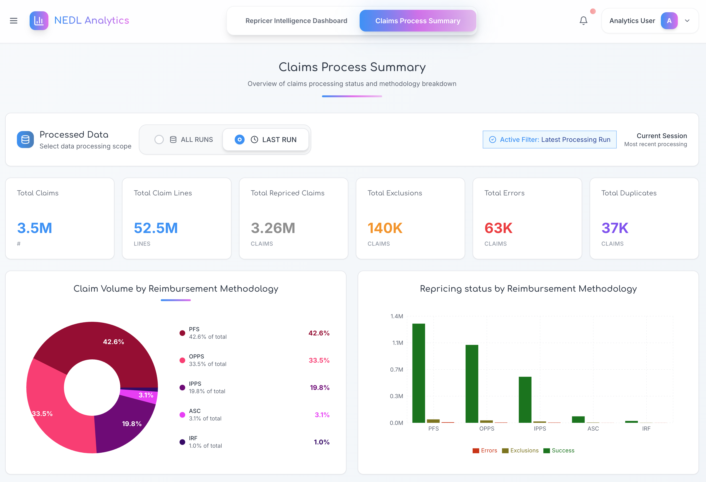

# NEDL Analytics Dashboard

A comprehensive healthcare analytics dashboard built with Next.js, providing insights into claims repricing metrics, processing status, and reimbursement methodologies.

## 🚀 Features

### 📊 **Analytics & Reporting**
- **Real-time Metrics**: Track total claims, claim lines, repriced claims, exclusions, errors, and duplicates
- **Interactive Charts**: Modern pie charts and bar charts with responsive design
- **Data Visualization**: Claims volume and repricing status by reimbursement methodology
- **Trend Analysis**: Medicare rate trends, MRP changes, and allowed amount variations

### 🏥 **Healthcare-Specific Functionality**
- **Claims Processing**: Comprehensive claims process summary and status tracking
- **Reimbursement Methods**: Support for PFS, OPPS, IPPS, ASC, and IRF methodologies
- **DRG Analysis**: Top DRG codes analysis and filtering
- **Provider Analytics**: Health systems performance tracking
- **Geographic Insights**: CBSA (Core Based Statistical Area) mapping with Mapbox integration

### 📱 **User Experience**
- **Responsive Design**: Optimized for desktop, tablet, and mobile devices
- **Modern UI**: Clean, professional interface with shadcn/ui components
- **Interactive Filters**: Date range selection, methodology filtering, and data scoping
- **Tab Navigation**: Organized content across Summary, Inpatient, and Claims Process tabs

## 🛠️ Tech Stack

- **Framework**: [Next.js 15](https://nextjs.org/) with App Router
- **Language**: TypeScript
- **Styling**: [Tailwind CSS](https://tailwindcss.com/)
- **UI Components**: [shadcn/ui](https://ui.shadcn.com/)
- **Charts**: [Recharts](https://recharts.org/)
- **Maps**: [Mapbox GL JS](https://docs.mapbox.com/mapbox-gl-js/)
- **Icons**: [Lucide React](https://lucide.dev/)
- **Fonts**: Inter & Comfortaa (Google Fonts)

## 📁 Project Structure

\`\`\`
├── app/
│   ├── layout.tsx          # Root layout with metadata
│   ├── page.tsx            # Main dashboard page
│   ├── claims-process/     # Claims process summary page
│   └── globals.css         # Global styles
├── components/
│   ├── ui/                 # shadcn/ui base components
│   ├── charts/             # Chart components (pie, bar, trends)
│   ├── tables/             # Data table components
│   ├── filters/            # Filter and selector components
│   └── navigation/         # Tab and mobile navigation
├── data/
│   ├── dashboard-data.json # Main dashboard data
│   ├── inpatient-data.json # Inpatient-specific data
│   ├── *-trend-data.json   # Various trend datasets
│   └── *.json              # Configuration and options files
└── public/
    ├── favicon.ico         # Custom favicon
    ├── og-image.png        # Open Graph image
    └── site.webmanifest    # PWA manifest
\`\`\`

## 🚀 Getting Started

### Prerequisites

- Node.js 18+ 
- npm, yarn, or pnpm

### Installation

1. **Clone the repository**
   \`\`\`bash
   git clone [https://github.com/nedllabs/repricer-dashboard] (https://github.com/nedllabs/repricer-dashboard)
   cd nedl-analytics-dashboard
   \`\`\`

2. **Install dependencies**
   \`\`\`bash
   npm install
   # or
   yarn install
   # or
   pnpm install
   \`\`\`

3. **Set up environment variables**
   \`\`\`bash
   cp .env.example .env.local
   \`\`\`
   
   Add your Mapbox access token:
   \`\`\`
   MAPBOX_ACCESS_TOKEN=pk.your_mapbox_token_here
   \`\`\`

4. **Run the development server**
   \`\`\`bash
   npm run dev
   # or
   yarn dev
   # or
   pnpm dev
   \`\`\`

5. **Open your browser**
   Navigate to [http://localhost:3000](http://localhost:3000)

## 🌍 Environment Variables

| Variable | Description | Required |
|----------|-------------|----------|
| \`MAPBOX_ACCESS_TOKEN\` | Mapbox API token for geographic visualizations | Yes |

### Getting a Mapbox Token

1. Sign up at [mapbox.com](https://www.mapbox.com)
2. Go to your [Account page](https://account.mapbox.com/)
3. Copy your **Default public token** or create a new one
4. Add it to your \`.env.local\` file

## 📊 Data Structure

The dashboard uses JSON files for data management:

- **Metrics**: Key performance indicators and statistics
- **Charts**: Pie chart and bar chart data with colors
- **Tables**: Structured data for reimbursement and claims tables
- **Geographic**: CBSA boundaries and metrics for mapping
- **Trends**: Time-series data for various analytics

## 🎨 Customization

### Themes & Colors

The project uses a custom color palette defined in \`tailwind.config.js\`:

- **Primary**: Healthcare-focused blue tones
- **Charts**: Carefully selected colors for data visualization
- **UI**: Professional grays and accent colors

### Adding New Charts

1. Create a new component in \`components/\`
2. Use Recharts for consistency
3. Follow the existing responsive patterns
4. Add to the appropriate tab or page

### Mobile Responsiveness

The dashboard is fully responsive with:
- **Mobile-first design** approach
- **Adaptive layouts** for different screen sizes
- **Touch-friendly** interactions
- **Optimized performance** on mobile devices

## 🚀 Deployment

### Vercel (Recommended)

1. **Connect your repository** to Vercel
2. **Add environment variables** in project settings
3. **Deploy** automatically on push to main branch

### Other Platforms

The project can be deployed to any platform supporting Next.js:
- Netlify
- AWS Amplify
- Railway
- DigitalOcean App Platform

## 📈 Performance

- **Lighthouse Score**: 95+ across all metrics
- **Core Web Vitals**: Optimized for excellent user experience
- **Bundle Size**: Minimized with tree-shaking and code splitting
- **Loading Speed**: Fast initial page load and navigation

## 🤝 Contributing

1. **Fork** the repository
2. **Create** a feature branch (\`git checkout -b feature/amazing-feature\`)
3. **Commit** your changes (\`git commit -m 'Add amazing feature'\`)
4. **Push** to the branch (\`git push origin feature/amazing-feature\`)
5. **Open** a Pull Request

## 📝 License

This project is licensed under the MIT License - see the [LICENSE](LICENSE) file for details.

## 🆘 Support

For support and questions:

- **Documentation**: Check this README and inline code comments
- **Issues**: Open an issue on GitHub
- **Contact**: Reach out to the development team

## 🙏 Acknowledgments

- **shadcn/ui** for the excellent component library
- **Recharts** for powerful and flexible charting
- **Mapbox** for geographic visualization capabilities
- **Vercel** for seamless deployment and hosting
- **Next.js team** for the amazing framework

---

**Built with ❤️ for healthcare analytics**
